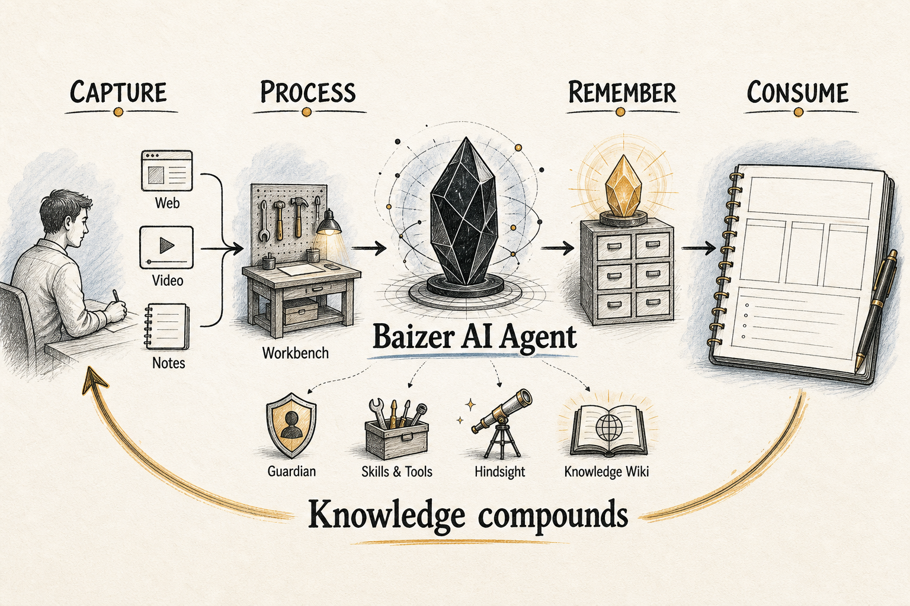

# Baizer

> English · [简体中文](./README.zh-CN.md)

Baizer is an AI knowledge workbench for Obsidian. Named after Bai Ze, the mythic beast that knew the nature of all things, it turns your vault into an AI-native pipeline: information flows in, gets understood, becomes durable memory, and is fed back into everything you write next.



## The Pipeline: AI End To End

Baizer is not a chatbot bolted onto Obsidian. It is a single loop where every stage — **Capture → Process → Remember → Consume** — is driven by the same AI runtime, so knowledge compounds instead of piling up.

```
  Capture            Process             Remember            Consume
 ─────────         ─────────           ──────────          ─────────
 web pages   ──▶   chat + tools   ──▶  Hindsight     ──▶   recall on
 videos            selection edits     memory (facts/       every turn
 search            Guardian writing    experience/          knowledge
 your notes        Knowledge Wiki      observation)         citations
                   compilation                              file-back
        ▲                                                        │
        └────────────────── closes the loop ────────────────────┘
```

### 1. Capture — bring the world into the vault

AI handles ingestion, not just download.

- **Web & articles**: `save_webpage` fetches a page, runs Readability to isolate the body, and converts it to clean Markdown with YAML frontmatter (`created`, `source`, `author`, `tags`), with extra handling for site-specific layouts.
- **Video**: YouTube and Bilibili URLs are resolved to their transcripts/subtitles, then summarized by the model into a readable note.
- **Live search**: `web_search` pulls fresh results from the web (DuckDuckGo) when the answer isn't in the vault yet, returned as cited Markdown links.

### 2. Process — understand and reshape

Everything you capture (and everything you already have) is worked on by the agent loop.

- **Workbench chat**: a streaming, tool-using agent that reads, writes, searches, and acts across the vault, with a foldable tool/thinking timeline.
- **Guardian**: an inline co-writer (Ghost Text) with a fast auto path and a deep path that escalates on dwell and pulls in knowledge-base context.
- **Selection actions**: select any text to Polish, Proofread, Translate, Expand, Summarize, or Explain — each with a preview before it touches the note.
- **Knowledge Wiki compilation**: chosen folders are compiled (Map-Reduce, ontology-driven, content-hash staleness) into structured, searchable wiki articles.

### 3. Remember — turn interactions into durable memory

Processing produces more than answers; it produces things worth keeping. Baizer's Hindsight memory captures them automatically.

- **Three record types**: `world` (durable facts about you and your domain), `experience` (what worked or failed on past tasks), and `observation` (lighter signals).
- **Polarity-aware**: a record can be `positive` (reinforce) or `negative` (rendered as "avoid this" to constrain future generations), learned from your 👍/👎 feedback.
- **Distilled, not dumped**: retention runs through the model to write reusable memories rather than raw transcripts, and a consolidator periodically merges and supersedes them.
- **Knowledge file-back**: high-value synthesized answers are archived back into the Knowledge Wiki (`file_back_knowledge`), so a good answer becomes a reusable source.

### 4. Consume — feed memory back into everything

The loop closes here. Stored knowledge and memory are injected into the next piece of work, everywhere generation happens.

- **Query-aware recall**: relevant memories are recalled and injected into the prompt on each turn — in Workbench chat, Guardian completions, and selection actions alike.
- **Knowledge citations**: `query_knowledge` retrieves compiled wiki articles; answers that cite them append explicit `[[wikilink]]` sources.
- **Context-scoped requests**: mention the current note, backlinks, recent notes, files, tags, selections, or images (where the provider supports it) to ground any request.

## Product Surfaces

Three surfaces sit on top of the pipeline:

- **Workbench** — a chat-first sidebar for asking, searching, clipping, editing, running tools, and inspecting AI execution.
- **Guardian** — an editor-side assistant that suggests continuations and edits without pulling you out of the note.
- **Knowledge Wiki** — a compiler that turns chosen folders into structured, searchable pages Baizer can cite and reuse.

Baizer speaks Obsidian's own language throughout: notes, wikilinks, frontmatter, backlinks, canvases, bases, plugins, selections, and explicit write permissions.

## Architecture Snapshot

The system is layered: **UI entry points → `ModelService` (facade) → pi runtime → Skills/Tools**, with Knowledge and Memory as side subsystems. All LLM inference runs through a single runtime built on the `@earendil-works/pi-agent-core` agent harness.

> Going deeper: [`CLAUDE.md`](./CLAUDE.md) is the fullest module-by-module map, and
> [`docs/architecture/`](./docs/architecture/) covers the runtime, skills, and
> permission model in detail. Start there before a first contribution.

### Core runtime

- `main.ts` — plugin bootstrap: wires subsystems, registers commands, the ShellView, CodeMirror extensions, vault/editor events, and Guardian debounce/single-flight/escalation.
- `src/services/model-service.ts` — the single entry to all LLM work: `chat`/`chatStream` drive the stateful agent loop, `generate` does stateless one-shot generation. Holds the tool/skill registries, memory, session store, steering, audit log, and workspace-edit service.
- `src/runtime/runtime-factory.ts` → `src/runtime/pi/harness-chat-runtime.ts` — `createChatRuntime()` returns a `HarnessChatRuntime` that drives the pi `AgentHarness`.
- `src/runtime/base-chat-runtime.ts` — the preparation layer: prompt assembly (memory recall + time + context + skill list + generation plan), skill resolution, and continuation handling.
- `src/runtime/pi/pi-native-model.ts` — maps a `ProviderConfig` to a pi-ai model + stream/complete functions and injects the API key.
- `src/runtime/pi/vault-session-fs.ts` + session projector — JSONL session persistence in the vault with auto-compaction and branch/retry projection.

### Tools and skills

- `src/skills/tool-registry.ts` — atomic tools, always exposed to the model in full.
- `src/skills/skill-registry.ts` — skills are behavior instructions (not execution); built-in `SKILL.md` files are materialized to a hidden vault dir, listed in the prompt, and pulled on demand via `read_skill` (progressive disclosure).
- `src/skills/builtin/` — vault-ops, web-search, web-clipper, knowledge, plugin-ctrl, obsidian-markdown, json-canvas, obsidian-bases. `plugin-ctrl` auto-generates skills for other installed plugins.
- `src/permissions/permission-service.ts` — pure-function permission decisions driven only by settings.

### Knowledge system

- `src/knowledge/runtime.ts` — lifecycle facade: commands, watchers, ontology discovery, query/file-back executors.
- `compiler.ts` (Map-Reduce compilation), `indexer.ts` + `metadata-index.ts` (searchable index + `.base` file), `ontology-service.ts` (schema discovery), `query.ts`, `file-back.ts`, `linter.ts`, `status-service.ts`, `watcher.ts`.

### Memory system

- `src/memory/memory-manager.ts` — facade over Hindsight.
- `hindsight-store.ts` / `hindsight-retriever.ts` / `hindsight-consolidator.ts` — store, semantic recall, and periodic consolidation of memory records.

### UI

- `src/ui/shell-view.ts` — Workbench view, tabs, history, context chips, streaming UI, workspace-edit bar.
- `src/ui/chat-controller.ts` — slash commands, approval handling, streaming coordination, 👍/👎 feedback.
- `src/ui/ghost-text.ts` / `guardian-completion.ts` / `guardian-gutter.ts` — Guardian inline suggestions and editor state.
- `src/ui/selection-ai/` + `selection-menu.ts` — selection-triggered AI actions with a floating panel.

## Supported Tools

- **Vault**: `read_note`, `create_note`, `update_note`, `append_to_note`, `delete_note`, `rename_note`, `list_notes`, `search_vault`, `open_file` (plus generic `read_file`/`create_file`/`update_file`).
- **Skills**: `read_skill` (always registered; pulls a skill's full instructions on demand).
- **Knowledge**: `query_knowledge`, `file_back_knowledge`.
- **External**: `save_webpage` (web pages plus YouTube / Bilibili transcripts), `web_search` (DuckDuckGo).
- **Plugin control** (gated by `allowPluginControl`): `list_plugins`, `get_plugin_commands`, `get_plugin_settings`, `execute_plugin_command`.
- **Generators**: `json-canvas` and `obsidian-bases` builtin skills for `.canvas` / `.base` output.

## Shell Commands

Built-in local commands:

- `/clear` — clear session history and start a fresh persistent session
- `/memory [overview|observations|search <query>|forget <field|all>]` — view, search, or forget Hindsight memory (`/profile`, `/forget` kept as aliases)
- `/tools` — list available tools
- `/help` — command help
- `/new <title>` — create a note
- `/edit <instruction>` — AI-edit the selected text
- `/open <file>` — open a file by name
- `/file-back <message-id>` — archive a previous answer into the Knowledge Wiki
- `/wiki:compile [path]` / `/wiki:index` / `/wiki:lint` — compile / open index / health check

Skill-backed commands: `/save <url>` (web-clipper), `/wiki:query` (knowledge). Type `@` for file autocomplete and `/` for command autocomplete.

## Permissions And Approvals

- `vaultWriteScope` — write boundary (`read-only`, `current-note`, `configured-folders`, `all-vault`)
- `vaultWriteAllowedFolders` — folder allowlist for `configured-folders`
- `allowFileCreation` / `allowFileModification` — gate creation vs. update/append/rename/delete
- `allowPluginControl` — gates plugin inspection and command execution
- `confirmExecutions` — turns write and plugin actions into approval requests

`.obsidian` writes are always blocked, even when the write scope is broad. With confirmation on, Baizer renders approval cards and replays approved actions with an explicit approval flag; editor-side writes use the same preview-first model and are recorded in the local audit log.

## Data Handling

**Baizer sends your note content to the AI provider you configure.** That is how
every feature here works — there is no local-only mode.

- **Where it goes:** only to the provider endpoint you set up yourself (Google
  Gemini, OpenAI, DeepSeek, Qwen, or any OpenAI-compatible base URL). Never to a
  Baizer-operated server — there isn't one.
- **What goes:** the notes, selections, and vault search results that a given
  feature needs as prompt context. Guardian sends surrounding text as you type.
- **No telemetry, no analytics, no data collection.**
- **Your API keys** are stored unencrypted in the plugin's `data.json` inside
  your vault's `.obsidian` folder — the standard Obsidian plugin mechanism.

Review your provider's data-usage policy before pointing Baizer at sensitive
notes. Full trust-boundary details are in [SECURITY.md](./SECURITY.md).

## Local Storage

Baizer keeps operational data inside the vault:

- `.obsidian/baizer/` — conversation history, the operation audit log, and materialized/generated skills.
- `.obsidian/baizer-sessions/` — per-conversation session transcripts (JSONL), including branch history.
- `.obsidian/baizer-memory/` — Hindsight memory, profiles, session summaries, observations.
- `.obsidian/baizer-commands/` — your own slash-command templates; drop a `.md` file here to add a command.
- `.obsidian/baizer-tmp/` — scratch files for the agent runtime.
- `Knowledge Wiki/` (default) — compiled knowledge output. This one is a normal, visible vault folder.

## Supported Providers

- Google Gemini
- OpenAI-compatible providers, including OpenAI, DeepSeek, Qwen, and custom base URLs

Provider capabilities (image input, custom base URL, etc.) are declared in code, so available features can differ by backend. Settings changes (provider/model/key/context window/thinking level) take effect on the next turn because the model handle is rebuilt each call.

## Development

```bash
npm install
npm test      # custom tsx harness via test/run-tests.ts
npm run build
npm run dev
```

## Installation

1. Download the latest release from the [Releases](https://github.com/yinfi/baizer/releases) page.
2. Extract `main.js`, `manifest.json`, and `styles.css` into `.obsidian/plugins/baizer/`.
3. Reload Obsidian and enable Baizer.

## Platform Support

Baizer runs on both desktop and mobile (iOS / Android) Obsidian — the manifest declares `isDesktopOnly: false`, and the code avoids Node-only APIs so the same build works everywhere. The Workbench, Guardian, selection actions, Knowledge Wiki, and memory all work on mobile; only OS-level differences (available hotkeys, file pickers) vary by device.

## Hotkeys

- `Mod+J` — open Baizer
- `Mod+Shift+G` — Guardian manual trigger

## License

MIT
