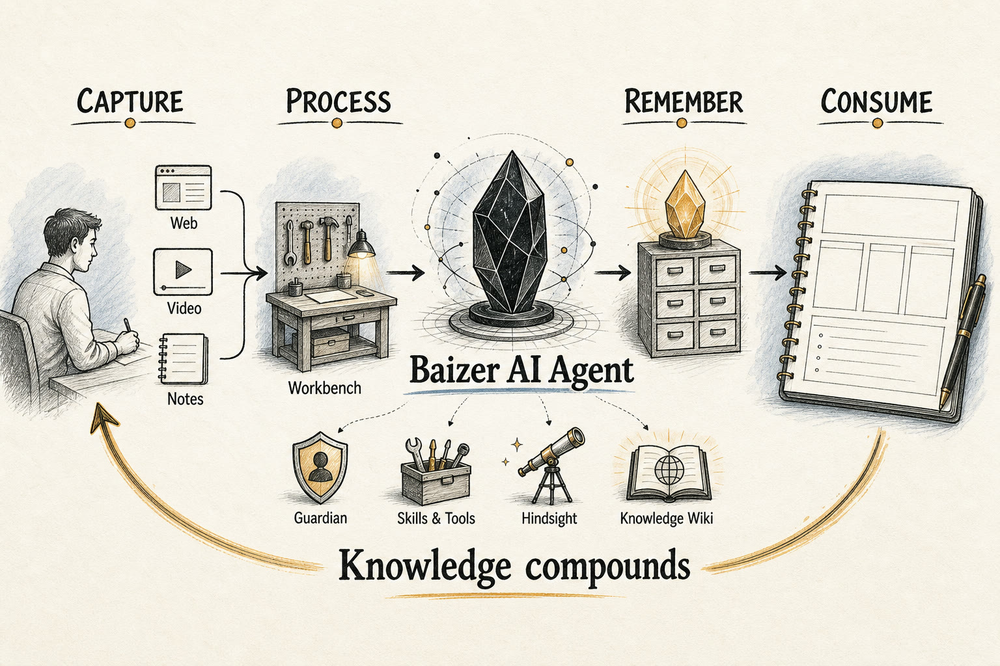

# Baizer

> [English](./README.md) · 简体中文

Baizer 是一个面向 Obsidian 的 AI 知识工作台。取名自上古神兽「白泽」——知天下万物之情——它把你的 vault 变成一条 AI 原生的流水线:信息流入、被理解、沉淀为可复用的记忆,再回流到你接下来写的每一段文字里。



## 主线:全流程 AI 化

Baizer 不是在 Obsidian 上外挂一个聊天框。它是一条闭环:**采集 → 处理 → 记忆 → 消费**,每一环都由同一套 AI 运行时驱动,让知识不断复利,而不是越堆越多。

```
   采集              处理               记忆               消费
 ─────────        ─────────          ──────────         ─────────
  网页       ──▶   对话 + 工具   ──▶   Hindsight    ──▶   每一轮都
  视频             选区改写            记忆(事实/         自动召回
  联网搜索          Guardian 写作      经验/观察)         知识引用
  你的笔记          知识库编译                            回填归档
        ▲                                                    │
        └────────────────── 闭环回流 ─────────────────────────┘
```

### 1. 采集 —— 把世界搬进 vault

由 AI 负责「入库」,而不只是下载。

- **网页与文章**:`save_webpage` 抓取页面,用 Readability 剥离正文,转成干净的 Markdown 并生成 YAML frontmatter(`created`、`source`、`author`、`tags`),并对特定站点的版式做额外处理。
- **视频**:YouTube、Bilibili 链接会被解析为转录/字幕,再由模型概括成可读笔记。
- **实时搜索**:当答案还不在 vault 里时,`web_search` 从互联网(DuckDuckGo)拉取最新结果,以带引用的 Markdown 链接返回。

### 2. 处理 —— 理解并重塑

采集进来的(以及你原有的)内容,都交给 agent 循环加工。

- **工作台对话**:一个流式、会用工具的 agent,能读写、搜索、跨 vault 行动,并带可折叠的工具/思考时间线。
- **Guardian**:行内协作写手(Ghost Text),快速自动路径 + 停顿后升级的深度路径,深度路径会引入知识库上下文。
- **选区动作**:选中任意文字即可润色、校对、翻译、扩写、概括、解释——每个动作落笔前都先预览。
- **知识库编译**:选定的文件夹被编译(Map-Reduce、本体驱动、内容哈希判定过期)成结构化、可检索的 wiki 文章。

### 3. 记忆 —— 把交互沉淀成可复用记忆

处理产出的不只是答案,还有值得留下的东西。Baizer 的 Hindsight 记忆会自动捕获它们。

- **三类记录**:`world`(关于你和你领域的持久事实)、`experience`(过往任务的成败经验)、`observation`(更轻量的信号)。
- **带极性**:一条记录可以是 `positive`(强化)或 `negative`(召回时渲染为「应避免」以约束后续生成),从你的 👍/👎 反馈中学习。
- **提炼而非转储**:沉淀过程走模型,写成可复用的记忆而不是原始对话流水;consolidator 会定期合并与替换旧记录。
- **知识回填**:高价值的综合性答案会被归档回知识库(`file_back_knowledge`),让一个好答案变成一个可复用的来源。

### 4. 消费 —— 把记忆回流到一切生成中

闭环在这里合上。沉淀下来的知识和记忆,会在下一次工作时被注入到每一处生成场景。

- **查询感知召回**:每一轮都会召回相关记忆并注入 prompt——工作台对话、Guardian 补全、选区动作一视同仁。
- **知识引用**:`query_knowledge` 检索已编译的 wiki 文章;引用了它们的答案会在末尾附上明确的 `[[wikilink]]` 来源。
- **上下文作用域**:通过 `@` 提及当前笔记、反链、近期笔记、文件、标签、选区或图片(取决于 provider 支持),为任意请求锚定上下文。

## 产品形态

三个界面架在这条流水线之上:

- **工作台(Workbench)**——以对话为中心的侧边栏,用于提问、搜索、剪藏、编辑、跑工具、检视 AI 执行过程。
- **Guardian**——编辑器一侧的助手,在不打断你写作的前提下建议续写与改写。
- **知识库(Knowledge Wiki)**——把选定文件夹编译成结构化、可检索页面的编译器,Baizer 可引用并复用。

整条链路都说 Obsidian 自己的语言:笔记、wikilink、frontmatter、反链、canvas、base、插件、选区,以及显式的写入权限。

## 架构速览

系统分层:**UI 入口 → `ModelService`(门面)→ pi 运行时 → 技能/工具**,知识与记忆作为旁路子系统。所有 LLM 推理都走同一套基于 `@earendil-works/pi-agent-core` agent harness 的运行时。

> 想读更深:[`CLAUDE.md`](./CLAUDE.md) 是最完整的逐模块地图,
> [`docs/architecture/`](./docs/architecture/) 详细讲运行时、技能、权限与配置页,
> [`CONTEXT.md`](./CONTEXT.md) 定义领域术语。第一次贡献前建议先看这几处。

### 核心运行时

- `main.ts` —— 插件引导:装配子系统,注册命令、ShellView、CodeMirror 扩展、vault/编辑器事件,以及 Guardian 的防抖/单飞/升级逻辑。
- `src/services/model-service.ts` —— 所有 LLM 工作的唯一入口:`chat`/`chatStream` 驱动有状态 agent 循环,`generate` 做无状态一次性生成;持有工具/技能注册表、记忆、会话存储、steering、审计日志与 workspace-edit 服务。
- `src/runtime/runtime-factory.ts` → `src/runtime/pi/harness-chat-runtime.ts` —— `createChatRuntime()` 返回驱动 pi `AgentHarness` 的 `HarnessChatRuntime`。
- `src/runtime/base-chat-runtime.ts` —— 准备层:prompt 组装(记忆召回 + 时间 + 上下文 + 技能清单 + 生成计划)、技能解析、续写处理。
- `src/runtime/pi/pi-native-model.ts` —— 把 `ProviderConfig` 映射为 pi-ai model + stream/complete 函数并注入 API key。
- `src/runtime/pi/vault-session-fs.ts` + 会话投影器 —— vault 内 JSONL 会话持久化,含自动压缩与分支/重试投影。

### 工具与技能

- `src/skills/tool-registry.ts` —— 原子工具,始终完整暴露给模型。
- `src/skills/skill-registry.ts` —— 技能是行为指令(非执行):内置 `SKILL.md` 会被物化到隐藏 vault 目录,prompt 里只列清单,模型按需通过 `read_skill` 拉取完整指令(渐进式披露)。
- `src/skills/builtin/` —— vault-ops、web-search、web-clipper、knowledge、plugin-ctrl、obsidian-markdown、json-canvas、obsidian-bases;`plugin-ctrl` 会为其它已安装插件自动生成技能。
- `src/permissions/permission-service.ts` —— 纯函数权限判定,策略只来自设置。

### 知识系统

- `src/knowledge/runtime.ts` —— 生命周期门面:命令、watcher、本体发现、query/file-back 执行器。
- `compiler.ts`(Map-Reduce 编译)、`indexer.ts` + `metadata-index.ts`(可检索索引 + `.base` 文件)、`ontology-service.ts`(schema 发现)、`query.ts`、`file-back.ts`、`linter.ts`、`status-service.ts`、`watcher.ts`。

### 记忆系统

- `src/memory/memory-manager.ts` —— Hindsight 的门面。
- `hindsight-store.ts` / `hindsight-retriever.ts` / `hindsight-consolidator.ts` —— 记忆记录的存储、语义召回与周期性整合。

### UI

- `src/ui/shell-view.ts` —— 工作台视图、标签页、历史、上下文 chip、流式 UI、workspace-edit 条。
- `src/ui/chat-controller.ts` —— slash 命令、审批处理、流式协调、👍/👎 反馈。
- `src/ui/ghost-text.ts` / `guardian-completion.ts` / `guardian-gutter.ts` —— Guardian 行内建议与编辑器状态。
- `src/ui/selection-ai/` + `selection-menu.ts` —— 选区触发的 AI 动作与浮动面板。

## 支持的工具

- **Vault**:`read_note`、`create_note`、`update_note`、`append_to_note`、`delete_note`、`rename_note`、`list_notes`、`search_vault`、`open_file`(另有通用 `read_file`/`create_file`/`update_file`)。
- **技能**:`read_skill`(始终注册;按需拉取某技能的完整指令)。
- **知识**:`query_knowledge`、`file_back_knowledge`。
- **外部**:`save_webpage`(网页,以及 YouTube / Bilibili 转录)、`web_search`(DuckDuckGo)。
- **插件控制**(受 `allowPluginControl` 管控):`list_plugins`、`get_plugin_commands`、`get_plugin_settings`、`execute_plugin_command`。
- **生成器**:`json-canvas`、`obsidian-bases` 内置技能,产出 `.canvas` / `.base`。

## Shell 命令

内置本地命令:

- `/clear` —— 清空会话历史并开启新的持久化会话
- `/memory [overview|observations|search <query>|forget <field|all>]` —— 查看/搜索/遗忘 Hindsight 记忆(保留 `/profile`、`/forget` 别名)
- `/tools` —— 列出可用工具
- `/help` —— 命令帮助
- `/new <title>` —— 新建笔记
- `/edit <instruction>` —— AI 编辑选中文本
- `/open <file>` —— 按名打开文件
- `/file-back <message-id>` —— 把某条历史答案归档进知识库
- `/wiki:compile [path]` / `/wiki:index` / `/wiki:lint` —— 编译 / 打开索引 / 健康检查

技能命令:`/save <url>`(web-clipper)、`/wiki:query`(knowledge)。输入 `@` 补全文件,`/` 补全命令。

## 权限与审批

- `vaultWriteScope` —— 写入边界(`read-only`、`current-note`、`configured-folders`、`all-vault`)
- `vaultWriteAllowedFolders` —— `configured-folders` 模式下的文件夹白名单
- `allowFileCreation` / `allowFileModification` —— 分别管控创建 与 更新/追加/重命名/删除
- `allowPluginControl` —— 管控插件检视与命令执行
- `confirmExecutions` —— 把写入与插件动作变成审批请求

`.obsidian` 写入始终被阻止,即使写入作用域很宽。开启确认后,Baizer 渲染审批卡片并以显式审批标记重放已批准动作;编辑器侧写入走同样的预览优先模型,并记入本地审计日志。

## 数据处理

**Baizer 会把你的笔记内容发送到你自己配置的 AI 服务商。** 这里的每一项功能都
以此为前提 —— 没有纯本地模式。

- **发往哪里:**只发往你自己配置的服务商端点(Google Gemini、OpenAI、DeepSeek、
  Qwen,或任意 OpenAI 兼容的 base URL)。绝不发往任何 Baizer 运营的服务器 ——
  这样的服务器并不存在。
- **发送什么:**具体功能所需的 prompt 上下文,即笔记内容、选中文本、库内搜索
  结果。Guardian 会在你打字时发送光标周围的文本。
- **无遥测、无统计分析、无数据收集。**
- **你的 API 密钥**以未加密形式存放在库内 `.obsidian` 目录下插件自己的
  `data.json` 中 —— 这是 Obsidian 插件的标准机制。

在让 Baizer 处理敏感笔记之前,请先了解你所用服务商的数据使用政策。完整的信任
边界说明见 [SECURITY.md](./SECURITY.md)。

## 本地存储

Baizer 把运行数据放在 vault 内:

- `.obsidian/baizer/` —— 对话历史、操作审计日志、物化/生成的技能。
- `.obsidian/baizer-sessions/` —— 每个会话的完整记录(JSONL),含分支历史。
- `.obsidian/baizer-memory/` —— Hindsight 记忆、profile、会话摘要、观察。
- `.obsidian/baizer-commands/` —— 你自己的斜杠命令模板,丢一个 `.md` 进来就多一条命令。
- `.obsidian/baizer-tmp/` —— agent 运行时的临时文件。
- `Knowledge Wiki/`(默认)—— 编译后的知识输出。这一个是正常可见的库内文件夹。

## 支持的 Provider

- Google Gemini
- OpenAI 兼容 provider,包括 OpenAI、DeepSeek、Qwen 及自定义 base URL

Provider 能力(图片输入、自定义 base URL 等)在代码中声明,不同后端可用功能有差异。设置变更(provider/模型/密钥/上下文窗口/思考等级)在下一轮生效,因为模型句柄每次调用都会重建。

## 开发

```bash
npm install
npm test      # 通过 test/run-tests.ts 的自定义 tsx harness
npm run build
npm run dev
```

## 安装

1. 从 [Releases](https://github.com/yinfi/baizer/releases) 页面下载最新版本。
2. 把 `main.js`、`manifest.json`、`styles.css` 解压到 `.obsidian/plugins/baizer/`。
3. 重载 Obsidian 并启用 Baizer。

## 平台支持

Baizer 同时支持桌面端和移动端(iOS / Android)Obsidian —— manifest 声明 `isDesktopOnly: false`,代码避开 Node 专用 API,同一份构建可在所有平台运行。工作台、Guardian、选区动作、知识库、记忆在移动端都可用;仅系统层面的差异(可用快捷键、文件选择器)因设备而异。

## 快捷键

- `Mod+J` —— 打开 Baizer
- `Mod+Shift+G` —— Guardian 手动触发

## 许可证

MIT
