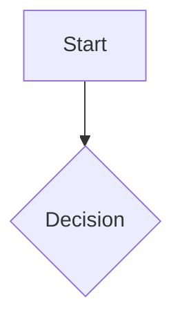

# Obsidian Flavored Markdown

Use this workflow when creating or editing Markdown notes that should render well in Obsidian.

## Workflow

1. Read the target note first when editing existing content.
2. Put YAML properties at the top of the note when metadata is needed.
3. Use wikilinks for vault notes and Markdown links for external URLs.
4. Use embeds for notes, headings, blocks, images, PDFs, audio, and video.
5. Use callouts for highlighted blocks.
6. Open the file when the user wants to inspect the rendered result in Obsidian.

## Wikilinks

```markdown
[[Note Name]]
[[Note Name|Display Text]]
[[Note Name#Heading]]
[[Note Name#^block-id]]
[[#Heading in same note]]
```

Define a paragraph block ID by appending it to the paragraph:

```markdown
This paragraph can be linked to. ^my-block-id
```

For lists and quotes, place the block ID on a separate line after the block.

## Embeds

```markdown
![[Note Name]]
![[Note Name#Heading]]
![[Note Name#^block-id]]
![[image.png]]
![[image.png|300]]
![[image.png|640x480]]
![[document.pdf#page=3]]
```

Use external Markdown image syntax only for external URLs:

```markdown


```

## Callouts

```markdown
> [!note]
> Basic callout.

> [!warning] Custom Title
> Callout with a custom title.

> [!faq]- Collapsed by default
> Foldable callout content.
```

Common types: `note`, `abstract`, `summary`, `tldr`, `info`, `todo`, `tip`, `hint`, `important`, `success`, `check`, `done`, `question`, `help`, `faq`, `warning`, `caution`, `attention`, `failure`, `fail`, `missing`, `danger`, `error`, `bug`, `example`, `quote`, `cite`.

Nested callouts are valid:

```markdown
> [!question] Outer callout
> > [!note] Inner callout
> > Nested content
```

## Properties

```yaml
---
title: My Note
date: 2024-01-15
tags:
  - project
  - active
aliases:
  - Alternative Name
cssclasses:
  - custom-class
status: in-progress
rating: 4.5
completed: false
due: 2024-02-01T14:30:00
---
```

Default properties:

- `tags`: searchable note tags
- `aliases`: alternative names used by link suggestions
- `cssclasses`: CSS classes applied by Obsidian

Property values may be text, numbers, checkboxes, dates, date-times, lists, or links. Quote wikilinks in YAML values, for example `related: "[[Other Note]]"`.

## Tags

```markdown
#tag
#nested/tag
#tag-with-dashes
#tag_with_underscores
```

Tags can contain letters, numbers except as the first character, underscores, hyphens, and forward slashes.

## Obsidian Extensions

```markdown
==Highlighted text==

%%hidden inline comment%%

%%
Hidden block comment.
%%
```

Math and Mermaid diagrams are supported:

````markdown
Inline math: $e^{i\pi} + 1 = 0$

$$
\frac{a}{b} = c
$$


````

## Link Choice

Use `[[wikilinks]]` for notes inside the vault because Obsidian tracks renames. Use `[text](url)` only for external URLs.
